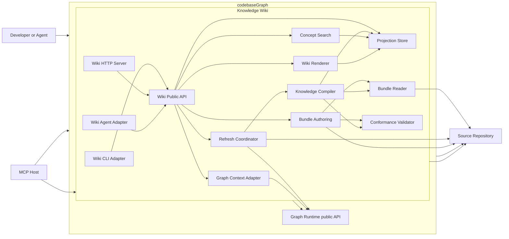

# OKF Wiki Subsystem — Full Implementation Plan

## Plan status

- Scryer changes: `chg-1` (wiki subsystem), `chg-2` (controlled MCP authoring)
- Scryer scope: `codebaseGraph / Knowledge Wiki` (`node-164`)
- Model validation: structurally clean
- Implementation status: in progress
- Sign-off status: approved by user on 2026-07-30

This plan turns the OKF v0.1 study into an implementable subsystem while
preserving the existing graph runtime and public API contracts. Production code
must not be changed until this plan is approved.

## Decision summary

Build a new workspace package at `crates/k-wiki/` as a separately deployable
Rust wiki service. It owns OKF parsing, conformance, compilation, controlled
source authoring, projection storage, search, rendering, refresh, HTTP, CLI,
and agent-tool behavior. Its MCP surface supports knowledge discovery plus
bounded creation and population of OKF bundles and pages. It consumes
source-graph context exclusively through `CodebaseGraphApi`.

The package must not reinterpret `DocumentationSource` or
`DocumentationChunk` as OKF concepts. The existing Markdown materializer only
captures documents and heading chunks (`src/parser/markdown.rs:8-173`,
`src/profiles.rs:69-82`), while the wiki requires lossless frontmatter,
reserved-file semantics, path-derived concept identity, links, backlinks,
citations, history, and permissive conformance.

## Scope

### Included

- One or more OKF v0.1 bundles under configured repository roots.
- Bundle discovery and stable namespacing.
- Lossless YAML frontmatter and Markdown-body parsing.
- `index.md` and `log.md` reserved-file semantics.
- Root `index.md` `okf_version` frontmatter exception.
- Consume, conformant, and recommended validation profiles.
- Stable concept IDs derived from bundle-relative paths.
- Absolute, relative, parent-relative, fragment, external, broken, and unsafe
  link handling.
- Directory navigation, synthetic indexes, backlinks, citations, scoped
  history, diagnostics, type facets, and tag facets.
- Versioned normalized projection artifacts stored outside `.codebaseGraph`.
- Deterministic full builds and content-hash incremental builds.
- Concept-aware full-text search.
- Static site generation and a local read-only HTTP preview/API server.
- CLI commands for validation, building, serving, inspection, and link checks.
- Read-only MCP tools for bundles, directories, concepts, search, backlinks,
  neighborhoods, diagnostics, and recent changes.
- Controlled MCP tools for creating bundles, creating pages, and populating
  page content.
- Optional source-code context through the existing graph public API.
- Accessibility, content sanitization, safe path handling, security headers,
  observability, release packaging, and performance verification.

### Excluded

- Browser-based authoring.
- Arbitrary source mutation outside configured OKF bundle roots and declared
  authoring operations.
- Authentication-backed multi-user editing.
- Pull-request creation.
- Dataplex or other catalog synchronization.
- Service-backed distributed search.
- Replacing the existing Markdown materializer or graph documentation nodes.
- Changing existing graph `OperationRequest` variants or current MCP tool names.

MCP authoring is intentionally narrower than a general editor: it accepts typed
bundle and page operations, validates the resulting OKF content, enforces
configured repository roots, detects stale writes, and publishes each source
change atomically. Interactive editing, arbitrary file writes, Git operations,
and multi-user conflict resolution remain outside this subsystem.

## Existing constraints

1. The workspace currently contains the root package and `crates/xtask`;
   `crates/k-wiki` must be added as a third member
   (`Cargo.toml:15-17`).
2. `CodebaseGraphApi::execute_operation` is the stable embedded graph entry
   point (`src/api/facade.rs:20-75`).
3. Public graph requests are transport-neutral and already distinguish typed
   and block outputs (`src/api/contracts.rs:18-104`).
4. The graph operation registry is authoritative for graph operations
   (`src/api/core.rs:75-202`).
5. Existing boundary tests prevent transport adapters from bypassing the public
   facade (`src/api/boundary_tests.rs:1-138`).
6. Graph MCP schemas are generated from operation metadata
   (`src/adapters/mcp/tools.rs:9-43`).
7. The graph refresh service already implements filtering, filesystem event
   normalization, and locking behavior (`src/api/refresh.rs:34-118`); the wiki
   may reuse public refresh behavior but must not import graph refresh
   internals.
8. Remote serving is local-first. Any remote listener requires an explicit
   security design rather than inheriting incomplete HTTP assumptions
   (`SECURITY.md:21-31`).
9. CI requires workspace formatting, tests, Clippy, advisory scanning, package
   dry-runs, and artifact smoke tests (`docs/release.md:22-31`).
10. New dependencies require explicit approval. Approval of this plan
    authorizes only the minimal dependency set recorded in Phase 0.

## Scryer architecture



### Scryer nodes

| Node | Scryer ID | Accountability |
| --- | --- | --- |
| Developer or Agent | `person-developer` | Uses repository graph and wiki capabilities |
| codebaseGraph | `system-codebase-graph` | Exposes repository knowledge to developers and agents |
| Knowledge Wiki | `node-164` | OKF publishing and controlled authoring boundary |
| Wiki Public API | `node-165` | Transport-neutral read and authoring operations |
| Bundle Reader | `node-166` | Bundle discovery and lossless document reading |
| Conformance Validator | `node-167` | Normative and advisory OKF checks |
| Bundle Authoring | `node-177` | Controlled bundle and page source writes |
| Knowledge Compiler | `node-168` | Concepts, directories, relationships, and history |
| Projection Store | `node-169` | Atomic versioned wiki artifacts |
| Concept Search | `node-170` | Search ranking, facets, and snippets |
| Graph Context Adapter | `node-171` | Optional `CodebaseGraphApi` composition |
| Wiki Renderer | `node-172` | Secure accessible static/browser presentation |
| Refresh Coordinator | `node-173` | Incremental rebuilds and refresh coordination |
| Wiki CLI Adapter | `node-174` | Command transport |
| Wiki HTTP Server | `node-175` | Local browser and JSON transport |
| Wiki Agent Adapter | `node-176` | Read/write MCP server displayed as `Knowledge Wiki` |

## Package and module layout

```text
crates/k-wiki/
  Cargo.toml
  src/
    lib.rs
    model.rs
    diagnostic.rs
    api/
      mod.rs
      contracts.rs
      registry.rs
      facade.rs
    bundle/
      mod.rs
      discover.rs
      document.rs
      reserved.rs
    conformance.rs
    authoring/
      mod.rs
      bundle.rs
      page.rs
      write.rs
    compiler/
      mod.rs
      identity.rs
      links.rs
      navigation.rs
      citations.rs
      history.rs
    projection/
      mod.rs
      manifest.rs
      store.rs
      cache.rs
    search/
      mod.rs
      index.rs
      ranking.rs
    graph_context.rs
    render/
      mod.rs
      markdown.rs
      routes.rs
      templates.rs
    refresh.rs
    adapters/
      mod.rs
      cli.rs
      http.rs
      mcp.rs
    bin/
      k-wiki.rs
  templates/
  assets/
  tests/
    fixtures/
      minimal/
      comprehensive/
      malformed/
      malicious/
      multi_bundle/
    bundle_reader.rs
    conformance.rs
    authoring.rs
    compilation.rs
    projection.rs
    search.rs
    graph_context.rs
    rendering.rs
    transports.rs
    refresh.rs
    end_to_end.rs
```

The final module names may change only when implementation evidence shows a
different cohesion boundary. Any such change must update Scryer before code is
kept.

## Normalized model

The public projection schema is versioned independently from OKF:

```text
WikiProjection
  schema_version
  generated_at
  source_revision
  bundles[]

Bundle
  id
  root_path
  okf_version
  title
  source_revision
  directories[]
  concepts[]
  diagnostics[]

Directory
  path
  title
  description
  index_source(authored|synthetic)
  body_markdown
  child_directories[]
  concept_ids[]
  log_entries[]

Concept
  id
  bundle_id
  source_path
  type
  title
  description
  resource
  tags[]
  timestamp
  extensions
  body_markdown
  headings[]
  outbound_links[]
  backlinks[]
  citations[]

Link
  source_id
  raw_href
  normalized_target_id
  fragment
  status(resolved|broken|external|rejected)
  context

Diagnostic
  severity(error|warning|info)
  code
  source_path
  line
  message

LogEntry
  scope_path
  date
  category
  text
  links[]
```

Rules:

- Source concepts do not gain an explicit required ID; identity remains the
  path without `.md`.
- Bundle IDs namespace concept IDs but do not alter their within-bundle value.
- Unknown frontmatter is stored losslessly in `extensions`.
- Broken links remain in the projection and are not build-fatal under the
  consume profile.
- Rendered HTML is derived output, not canonical source data.
- Source paths are display-safe relative paths; absolute filesystem paths do
  not enter public responses.

## Wiki public API

Create a parallel `OkfWikiApi`; do not add wiki variants to the graph
`OperationRequest` in `src/api/contracts.rs:18-37`.

### Requests

```text
WikiOperationRequest
  Health
  ValidateBundle
  CreateBundle
  CreatePage
  PopulatePage
  BuildProjection
  ListBundles
  GetDirectory
  GetConcept
  SearchConcepts
  GetBacklinks
  GetNeighborhood
  GetDiagnostics
  GetRecentChanges
  RenderSite
```

Every request carries a typed record. Repository/bundle selectors must be
resolved once before dispatch. The wiki operation registry is the single source
for CLI, HTTP, and agent-tool metadata, mirroring the graph registry pattern at
`src/api/core.rs:75-202` without importing it.

### Responses and errors

- `WikiOperationResponse` is a typed enum, not an unstructured transport value.
- JSON adapters serialize the typed response at the boundary.
- `WikiApiError` contains a stable code, safe message, optional structured
  details, and retryability.
- Public errors must not contain absolute paths, source contents, secrets, or
  raw parser failures.
- Stable error codes include:
  `invalid_request`, `bundle_not_found`, `bundle_exists`,
  `concept_not_found`, `concept_exists`, `path_outside_repository`,
  `invalid_frontmatter`, `write_conflict`, `projection_unavailable`,
  `build_in_progress`, `render_failed`, and `graph_context_unavailable`.

### Authoring contract

- `CreateBundle` initializes a bundle only under a configured repository root
  and writes its root `index.md` with the selected OKF version.
- `CreatePage` creates one concept from a validated bundle-relative path and
  fails rather than overwriting an existing source file.
- `PopulatePage` writes typed frontmatter and Markdown content to an existing
  page while preserving unknown frontmatter fields unless explicitly replaced.
- Populate requests carry the source revision or content hash observed by the
  caller; a mismatch returns `write_conflict`.
- All authoring paths are resolved beneath the selected bundle without
  following escaping symlinks.
- Content is validated before publication and written through a same-directory
  temporary file plus atomic replacement.
- A successful write enters the normal refresh pipeline; write tools do not
  edit projection artifacts directly.

### Graph composition

`GraphContextAdapter` may construct only public `SearchRequest`,
`ContextRequest`, and `HealthRequest` values and call
`CodebaseGraphApi::execute_operation` (`src/api/facade.rs:69-75`).

- End-user routes must not issue arbitrary graph `QueryRequest`.
- Graph results are translated into bounded wiki summaries.
- Graph failure never blocks OKF concept rendering.
- No wiki component imports `src/api/core.rs`, graph storage, CLI adapters, or
  MCP adapters.
- Add boundary tests equivalent to
  `transport_adapters_use_only_the_public_api_facade`
  (`src/api/boundary_tests.rs:94-138`).

## Storage and artifact contract

Use a separate repository-local state root:

```text
.kWiki/
  manifest.json
  projections/
    <bundle-id>.json
  search/
    <bundle-id>.idx
  cache/
    <content-hash>.json
  site/
    ...
  diagnostics.json
```

The manifest records schema version, OKF version, bundle roots, source
revision, content hashes, dependency edges, output hashes, build duration, and
the last successful generation.

Publication protocol:

1. Build into a uniquely named staging directory under `.kWiki`.
2. Validate all declared artifacts and route manifests.
3. Atomically replace the published manifest and projection pointer.
4. Remove obsolete staging data only after the new generation is visible.
5. Preserve the last valid generation after parse, render, or graph failures.

No existing `.codebaseGraph` database or manifest migration is required.

## Routes

```text
/
/b/:bundle/
/b/:bundle/d/:directory-path
/b/:bundle/c/:concept-id
/b/:bundle/type/:type
/b/:bundle/tag/:tag
/b/:bundle/search
/b/:bundle/graph
/b/:bundle/changes
/b/:bundle/diagnostics
/api/v1/health
/api/v1/bundles
/api/v1/bundles/:bundle/directories/:path
/api/v1/bundles/:bundle/concepts/:id
/api/v1/bundles/:bundle/search
/api/v1/bundles/:bundle/diagnostics
```

Route segments use reversible percent-encoding. Path normalization must not
permit escaping a bundle root, and concept URLs remain stable across releases.

## Implementation sequence

### Phase 0 — Contracts, fixtures, workspace, and dependency gate

Files:

- `Cargo.toml`
- `Cargo.lock`
- `crates/k-wiki/Cargo.toml`
- `crates/k-wiki/src/lib.rs`
- `crates/k-wiki/src/model.rs`
- `crates/k-wiki/src/diagnostic.rs`
- `crates/k-wiki/tests/fixtures/**`

Work:

1. Add `crates/k-wiki` to the workspace.
2. Add library and `k-wiki` binary targets.
3. Define the normalized data model, diagnostics, schema version, and fixture
   corpus.
4. Record the attached OKF v0.1 draft as the conformance source.
5. Select the minimal maintained dependencies for:
   - YAML parsing,
   - CommonMark/GFM events,
   - HTML sanitization,
   - compile-time templates,
   - async local HTTP,
   - CLI parsing,
   - static search.
6. Require an explicit dependency review before adding packages. Prefer
   pure-Rust, memory-safe, cross-platform libraries and reuse workspace
   dependencies where suitable.

Exit criteria:

- `cargo metadata --no-deps` resolves the new package on all supported targets.
- Fixture coverage maps every normative OKF v0.1 rule to at least one test
  case.
- Public projection serialization is deterministic and round-trips.
- No production graph behavior changes.

### Phase 1 — Bundle Reader and Conformance Validator

Scryer responsibilities:

- Bundle Reader: `resp-168` through `resp-172`
- Conformance Validator: `resp-173` through `resp-176`

Files:

- `src/bundle/**`
- `src/conformance.rs`
- `tests/bundle_reader.rs`
- `tests/conformance.rs`

Work:

1. Discover configured bundle roots without following escaping symlinks.
2. Decode UTF-8, split frontmatter from body, and parse safe YAML values.
3. Parse required `type`, optional standard fields, and lossless extensions.
4. Classify normal concepts, `index.md`, and `log.md`.
5. Allow only bundle-root `index.md` to carry version metadata.
6. Implement `consume`, `conformant`, and `recommended` profiles.
7. Emit line-aware stable diagnostics.

Exit criteria:

- Every non-reserved Markdown file is classified exactly once.
- Unknown types and keys remain consumable.
- Only missing/invalid required semantics fail the conformant profile.
- Traversal and symlink escape fixtures are rejected.

Scryer close:

- Add symbol nodes only for implemented public definitions and data shapes.
- Attach every condition-shaped test to its matching responsibility.
- Fold only `resp-168` through `resp-176`.

### Phase 2 — Controlled bundle and page authoring

Scryer responsibilities: `resp-210` through `resp-215`

Files:

- `src/authoring/**`
- `tests/authoring.rs`

Work:

1. Resolve every write against an explicitly configured repository and bundle
   root.
2. Implement `CreateBundle` with a conformant root index and fail-if-present
   semantics.
3. Implement `CreatePage` with bundle-relative identity validation and
   fail-if-present semantics.
4. Implement `PopulatePage` with typed frontmatter, Markdown content, extension
   preservation, and an expected source revision or content hash.
5. Validate authored content before replacing its destination.
6. Write through a same-directory temporary file, flush it, and atomically
   replace the destination.
7. Reject absolute paths, traversal, escaping symlinks, invalid reserved-file
   targets, stale revisions, and writes outside permitted roots.
8. Notify the refresh coordinator only after a successful source write.

Exit criteria:

- Agents cannot write outside configured OKF roots or target arbitrary
  repository files.
- Creating an existing bundle or page fails without modifying it.
- A stale populate request returns `write_conflict` without losing either
  version.
- Failure injection never leaves truncated or partially written Markdown.
- Successful writes become readable through the normal projection pipeline.

Scryer close: fold `resp-210` through `resp-215` with path-safety, conflict,
validation, and atomic-write tests attached.

### Phase 3 — Knowledge Compiler

Scryer responsibilities: `resp-177` through `resp-181`

Files:

- `src/compiler/**`
- `tests/compilation.rs`

Work:

1. Derive concept IDs and namespaced route identities.
2. Build directory trees and authored/synthetic indexes.
3. Resolve bundle-absolute, document-relative, parent-relative, and fragment
   links with traversal prevention.
4. Build outbound links and backlinks.
5. Retain unresolved links as diagnostics and visible graph edges.
6. Extract headings and numbered citation sections.
7. Parse ISO date-grouped `log.md` entries and aggregate scoped history.
8. Produce deterministically ordered normalized projections.

Exit criteria:

- Repeated compilation produces byte-identical normalized JSON when source and
  build metadata are fixed.
- Link and backlink tests cover add, change, remove, broken, fragment, and
  escaping targets.
- Synthetic navigation is stable.

Scryer close: fold `resp-177` through `resp-181` with unit and integration test
attachments.

### Phase 4 — Projection Store and incremental invalidation

Scryer responsibilities:

- Projection Store: `resp-182` through `resp-185`
- Refresh Coordinator foundation: `resp-198`, `resp-200`, `resp-201`

Files:

- `src/projection/**`
- `src/refresh.rs`
- `tests/projection.rs`
- `tests/refresh.rs`

Work:

1. Define `.kWiki` manifest and generation schemas.
2. Add content-hash cache keys and dependency-aware invalidation.
3. Publish complete generations atomically.
4. Preserve the last valid generation after failure.
5. Serialize competing builds so stale work cannot overwrite newer state.
6. Invalidate:
   - one concept page, its search document, outgoing edges, and affected
     backlink pages after concept changes;
   - the scoped directory and dependent ancestors after `index.md` changes;
   - scoped and aggregate history after `log.md` changes.

Exit criteria:

- Kill/failure injection never exposes a partial generation.
- An unchanged rebuild is a cache hit.
- Concurrent build tests prove the newest source generation wins.
- `.codebaseGraph` state remains untouched.

Scryer close: fold the implemented store responsibilities and only the refresh
responsibilities completed in this phase.

### Phase 5 — Concept Search

Scryer responsibilities: `resp-186` through `resp-189`

Files:

- `src/search/**`
- `tests/search.rs`

Work:

1. Index concept ID, title, type, tags, description, headings, body,
   citations, and selected scalar extensions.
2. Rank exact title and concept-ID matches above prefix, metadata, heading, and
   body matches.
3. Add bundle, type, and tag filters.
4. Return bounded highlighted snippets and deterministic tie-breaking.
5. Keep graph search separate from concept search.

Exit criteria:

- Golden ranking cases pass.
- Search output order is deterministic.
- A 10,000-concept fixture stays within the agreed memory and build budgets.

Scryer close: fold `resp-186` through `resp-189`.

### Phase 6 — Wiki Public API and graph context

Scryer responsibilities:

- Wiki Public API: `resp-165` through `resp-167`
- Graph Context Adapter: `resp-190` through `resp-192`

Files:

- `src/api/**`
- `src/graph_context.rs`
- `tests/graph_context.rs`
- API boundary tests

Work:

1. Implement typed request, response, selector, descriptor, and error contracts.
2. Implement one registry and one facade execution path.
3. Route authoring, build, read, search, diagnostics, changes, and render
   operations.
4. Implement optional source-graph context using only `CodebaseGraphApi`.
5. Bound graph result count, context depth, and exposed fields.
6. Add import-boundary tests preventing direct graph-core/storage access.
7. Verify graph failures degrade context only.

Exit criteria:

- A facade spy observes one dispatch per wiki request, matching the graph facade
  invariant at `src/api/facade.rs:105-124`.
- Every operation serializes and validates.
- No wiki module imports graph internals or transport adapters.
- Existing graph API and MCP contract snapshots remain unchanged.

Scryer close: fold `resp-165` through `resp-167` and `resp-190` through
`resp-192`.

### Phase 7 — Secure renderer and developer/agent experience

Scryer responsibilities: `resp-193` through `resp-197`

Files:

- `src/render/**`
- `templates/**`
- `assets/**`
- `tests/rendering.rs`

Work:

1. Render all declared routes from normalized projections.
2. Sanitize raw HTML, event handlers, scripts, unsafe SVG, and unsafe URL
   schemes.
3. Add breadcrumbs, table of contents, metadata, body, backlinks, citations,
   source links, related graph context, and diagnostics.
4. Render hierarchy, type, tag, search, graph-neighborhood, change, and
   diagnostic views.
5. Provide server-rendered navigation and reading without JavaScript.
6. Add progressive enhancement for search and graph exploration.
7. Meet WCAG 2.2 AA for core reading and navigation.
8. Use stable versioned route helpers rather than template-local URL logic.

Exit criteria:

- Malicious fixtures cannot execute active content.
- Keyboard-only journeys cover home, directory, concept, search, and
  diagnostics.
- Automated accessibility checks report no critical or serious violations.
- Generated internal links all resolve or appear as explicit broken-link
  diagnostics.

Scryer visual gate:

- Capture and accept representative desktop and narrow-width fixtures for the
  visual `Wiki Renderer` component before folding appearance.

Scryer close: fold `resp-193` through `resp-197` with security, accessibility,
and route tests attached.

### Phase 8 — CLI, HTTP, and agent adapters

Scryer responsibilities:

- Wiki CLI Adapter: `resp-202`, `resp-203`
- Wiki HTTP Server: `resp-204` through `resp-207`
- Wiki Agent Adapter: `resp-208`, `resp-209`

Files:

- `src/adapters/**`
- `src/bin/k-wiki.rs`
- `tests/transports.rs`

CLI:

```text
k-wiki validate <bundle> [--profile consume|conformant|recommended] [--json]
k-wiki build <bundle> --out <directory> [--base-url <path>]
k-wiki serve <bundle> [--host 127.0.0.1] [--port 4321]
k-wiki inspect <bundle> --concept <concept-id>
k-wiki check-links <bundle> [--include-external]
```

Publicly advertised MCP tools:

| Tool identifier | Display name | Access |
| --- | --- | --- |
| `wiki_list_bundles` | `List Bundles` | Read |
| `wiki_list_directory` | `List Directory` | Read |
| `wiki_get_concept` | `Get Concept` | Read |
| `wiki_search_concepts` | `Search Concepts` | Read |
| `wiki_get_backlinks` | `Get Backlinks` | Read |
| `wiki_get_neighborhood` | `Get Neighborhood` | Read |
| `wiki_get_diagnostics` | `Get Diagnostics` | Read |
| `wiki_get_recent_changes` | `Get Recent Changes` | Read |
| `wiki_create_bundle` | `Create Bundle` | Write |
| `wiki_create_page` | `Create Page` | Write |
| `wiki_populate_page` | `Populate Page` | Write |

The MCP initialization metadata must use the exact user-facing server display
name `Knowledge Wiki`. Internal package, binary, and tool identifiers do not
alter this display name.

Work:

1. Generate transport schemas from the wiki operation registry.
2. Keep CLI, HTTP, and MCP mappings thin and peer-level.
3. Bind HTTP to localhost by default.
4. Require a separate approved security change before remote binding.
5. Apply CSP, `nosniff`, referrer, framing, and cache headers.
6. Return safe error bodies without absolute paths.
7. Preserve error codes across transports.
8. Mark the eight discovery tools as read-only and the three authoring tools as
   write operations in MCP metadata.
9. Route every authoring tool through `OkfWikiApi` and `Bundle Authoring`;
   adapters must never write repository files directly.

Exit criteria:

- Every adapter dispatches exactly once through `OkfWikiApi`.
- Registry metadata advertises exactly the eleven identifiers, display names,
  and access modes declared above.
- MCP clients display the server name exactly as `Knowledge Wiki`.
- Write-tool tests cover allowed roots, traversal, symlink escape, existing
  targets, stale revisions, validation failures, and atomic replacement.
- HTTP and agent protocol conformance tests pass.
- Remote binding is impossible without an explicit configuration gate.

Scryer close: fold `resp-202` through `resp-209`.

### Phase 9 — Coordinated refresh

Scryer responsibility: `resp-199` plus any remaining `resp-198` through
`resp-201`

Files:

- `src/refresh.rs`
- graph/watcher composition tests

Work:

1. Reuse public graph refresh operations rather than importing
   `src/api/refresh.rs`.
2. Debounce repository changes once when both graph and wiki refresh are
   enabled.
3. Partition changed paths for graph, wiki, or both.
4. Keep graph and wiki locks independent.
5. Surface per-consumer status and retryability.
6. Continue serving the last valid wiki projection during graph or wiki
   refresh failures.

Exit criteria:

- One file event produces at most one wiki build generation and one graph
  refresh request.
- Graph failure does not block wiki publication.
- Wiki failure does not block graph reads.
- Burst, rename, deletion, and shutdown tests pass.

Scryer close: fold remaining refresh responsibilities.

### Phase 10 — Packaging, release, performance, and end-to-end proof

Files:

- `README.md`
- `SECURITY.md`
- `docs/k-wiki.md`
- `docs/release.md`
- `.github/workflows/**`
- `crates/xtask/src/main.rs`
- artifact smoke fixtures

Work:

1. Include templates and assets in release archives.
2. Add isolated package smoke tests.
3. Extend workspace CI and release gates.
4. Document state, commands, routes, validation profiles, threat boundaries,
   rollback, and troubleshooting.
5. Benchmark 1,000, 10,000, and 50,000 concept bundles.
6. Emit build timings, document/edge counts, broken-link counts, cache hits,
   generation IDs, and artifact sizes.
7. Run end-to-end static build, local server, HTTP, agent-tool, security, and
   accessibility journeys.

Exit criteria:

- The release package builds and serves a package-owned fixture without source
  tree assets.
- Workspace CI remains green on Linux, macOS, and Windows.
- A 10,000-concept full build completes in under two minutes on the selected CI
  runner; an unchanged incremental rebuild completes in under ten seconds.
- Static reading remains functional when graph context, search enhancement,
  and the preview server are unavailable.

Final Scryer close:

- Fold container responsibilities `resp-161` through `resp-164`.
- Fold actor responsibility `resp-1`.
- Fold the broadened system responsibility `resp-5`.
- Fold the restored actor-to-system relationship `link-developer-system`.
- Fold all links whose endpoints are implemented.
- Attach system-level end-to-end tests.
- Run `validate_model`, `get_health(node-164)`, `get_pending(chg-1)`, and
  `get_pending(chg-2)`.
- Close `chg-1` and `chg-2` only when both queues are empty and tests are
  attached to every implemented condition-shaped claim.

## Acceptance criteria

1. Every non-reserved `.md` file appears exactly once as a concept.
2. Concept IDs equal bundle-relative paths without `.md`.
3. `index.md` and `log.md` never appear as concepts.
4. Root `index.md` accepts `okf_version`; nested indexes reject frontmatter
   under the conformant profile.
5. A document containing only non-empty `type` plus a body is conformant.
6. Missing optional fields never prevent consume-mode rendering.
7. Unknown types render generically and remain searchable.
8. Unknown frontmatter keys survive parse and serialization round trips.
9. Absolute, relative, parent-relative, and fragment links resolve to canonical
   routes.
10. Broken internal links remain visible and generate diagnostics.
11. Paths and symlinks cannot escape configured repository roots.
12. Backlinks update after link addition, change, removal, or target rename.
13. Authored indexes render; missing indexes receive deterministic synthesized
    navigation.
14. Scoped logs aggregate newest-first without becoming concepts.
15. Search ranks exact title and concept-ID matches above body-only matches and
    supports bundle/type/tag filters.
16. Duplicate within-bundle IDs fail deterministically; identical concept IDs
    across bundles remain namespaced.
17. A failed compile or render leaves the last valid projection readable.
18. Repeated builds are deterministic apart from explicitly declared volatile
    metadata.
19. Malicious Markdown, HTML, links, YAML tags, and SVG cannot execute code or
    escape the output root.
20. Core reading and navigation pass WCAG 2.2 AA checks and keyboard-only
    journeys.
21. HTTP binds locally by default and emits the required security headers.
22. CLI, HTTP, and agent adapters return the same semantic result and error
    codes for equivalent requests.
23. Graph context uses only `CodebaseGraphApi` and degrades without blocking
    concept delivery.
24. Existing graph public requests, MCP names, block snapshots, and
    `.codebaseGraph` state remain backward compatible.
25. Full and incremental performance budgets pass on the agreed CI runner.
26. `wiki_create_bundle` creates a conformant bundle only beneath a configured
    repository root and never overwrites an existing bundle.
27. `wiki_create_page` creates one valid concept at a bundle-relative identity
    and never overwrites an existing page.
28. `wiki_populate_page` atomically updates validated frontmatter and Markdown
    while preserving unknown fields.
29. Write tools reject traversal, absolute paths, escaping symlinks, invalid
    reserved-file targets, and destinations outside permitted bundle roots.
30. Stale populate requests return `write_conflict` without changing source
    content.
31. MCP initialization advertises the exact server name, tool identifiers,
    display names, and read/write access modes declared in Phase 8.

## Test strategy

### Unit

- Frontmatter boundaries, YAML values, timestamp parsing, extension
  preservation.
- Reserved-file classification and root-index exception.
- Concept ID and route encoding.
- Link normalization, fragments, traversal, safe schemes.
- Conformance severity and profile behavior.
- Log and citation parsing.
- Search tokenization, field boosts, filtering, snippets, tie-breaking.
- Cache keys and invalidation sets.
- HTML sanitization and header construction.
- Authoring path resolution, reserved-file rules, revision preconditions, and
  temporary-file publication.

### Integration

- Bundle discovery through normalized projection.
- Projection persistence and atomic rollback.
- Incremental backlink and search updates.
- Multi-bundle identity isolation.
- Wiki public API registry and dispatch.
- Bundle creation, page creation, page population, conflict rejection, and
  post-write refresh.
- Graph public API composition and degraded mode.
- Static route manifest and output verification.
- Transport parity across CLI, HTTP, and MCP.

### End to end

- Validate, build, browse, search, follow links, inspect backlinks, view graph
  context, view changes, and inspect diagnostics.
- Create a bundle and page through MCP, populate it, then read and search the
  resulting concept through MCP.
- Repeat with graph runtime unavailable.
- Repeat with malformed and malicious fixtures.
- Run on Windows path fixtures and symlink-capable Unix fixtures.
- Package, extract, build a fixture, start preview, and issue HTTP/agent calls.

### Observability

- Full and incremental build duration by stage.
- Files scanned, parsed, reused, and rejected.
- Concepts, directories, links, backlinks, citations, logs, and diagnostics.
- Cache hit ratio and output bytes.
- Refresh generation, queue depth, coalesced event count, and last success.
- Graph context latency and degraded-call count.
- Authoring attempts, successful writes, validation failures, and write
  conflicts without recording source content.

## Required verification commands

```bash
cargo fmt --check
cargo clippy --workspace --all-targets --all-features --locked -- -D warnings
cargo test --workspace --locked
cargo test -p k-wiki --all-features --locked
cargo run -p k-wiki -- validate crates/k-wiki/tests/fixtures/comprehensive
cargo run -p k-wiki -- build crates/k-wiki/tests/fixtures/comprehensive --out /tmp/k-wiki-site
cargo run -p xtask -- release-gate
```

Security, accessibility, determinism, isolated-package, and performance
commands must be added to the package as stable scripts or `xtask` operations
rather than remaining undocumented one-off commands.

## Risks and mitigations

| Risk | Mitigation |
| --- | --- |
| OKF 0.1 changes while implementation is underway | Version the projection and validator; isolate spec rules in fixtures |
| YAML/Markdown libraries expand the attack surface | Minimal maintained dependencies, safe modes, sanitizer, advisory scan |
| Existing graph API leaks into wiki domain contracts | Dedicated adapter and import-boundary tests |
| Two refresh loops race or duplicate work | One debounced event stream, independent locks, generation tokens |
| Static search payload grows too large | Separate compressed indexes, lazy loading, measured escalation threshold |
| Broken or partial builds replace valid output | Staging generation plus atomic publish |
| Unknown extensions are lost | Lossless value map and round-trip tests |
| URLs change after refactors | Central route contract and snapshot tests |
| Graph outages make wiki unreadable | Optional bounded context and explicit degraded responses |
| Agent writes overwrite repository knowledge | Permitted roots, fail-if-present creation, revision preconditions, validation, and atomic replacement |
| Remote HTTP is mistaken for multi-user security | Localhost default; separate approved security change for remote mode |
| New package breaks release portability | Pure-Rust dependencies, cross-platform CI, isolated artifact smoke |
| UI becomes the source of truth | Read-only UI; generated output remains disposable |

## Sign-off gate

Approval of this plan authorizes implementation against Scryer changes `chg-1`
and `chg-2`, phase by phase. It authorizes only the declared MCP bundle/page
source writes beneath configured roots; it does not authorize browser
authoring, arbitrary file writes, Git operations, remote multi-user serving, or
catalog synchronization.

After approval, implementation must start with Phase 0 and must update Scryer
with concrete symbols, anchors, and attached tests as each responsibility is
built. No unimplemented responsibility may be anchored or folded.
