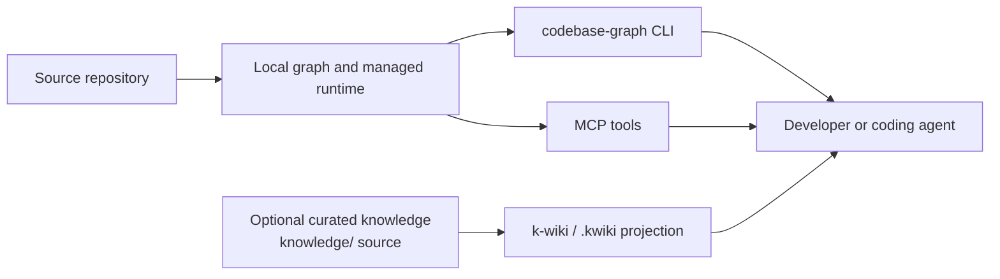

# codebaseGraph

> Give coding agents a map before they touch the code.

[](https://crates.io/crates/codebase-graph)
[](https://github.com/rabii-chaarani/codebaseGraph/actions/workflows/ci.yml)
[](LICENSE)

`codebaseGraph` builds a local, automatically refreshed graph of your repository
and exposes it through a native CLI and MCP, giving developers and AI coding
agents focused answers about unfamiliar code.

Use it to:

- find definitions, symbols, and architectural entry points;
- trace dependencies, callers, and runtime paths;
- inspect likely change impact before editing; and
- retrieve compact context, schemas, and bounded read-only query results.

[Install](#quick-start) · [See a query](#a-first-query) ·
[Connect MCP](#connect-an-mcp-client) · [Understand the flow](#how-it-works)

## A first query

After setup, search for a symbol or concept from your repository:

```text
$ codebase-graph codebase-search "run_refresh_leader" --repo-root .
q run_refresh_leader layer=semantic
file path src/api/refresh.rs
- Function run_refresh_leader L2392-L2519 rank_score=0.97
```

This is illustrative compact block output; exact matches depend on the graph.

## Quick start

Install from crates.io with Cargo (Rust 1.82 or newer) from the repository you
want to index:

```bash
cargo install codebase-graph
codebase-graph install
codebase-graph check-health --repo-root .
```

Prefer a prebuilt binary? Download a platform archive from [GitHub
Releases](https://github.com/rabii-chaarani/codebaseGraph/releases), put
`codebase-graph` on your `PATH`, and run the same `install` and health commands.
For development from this checkout:

```bash
cargo install --path . --bin codebase-graph
```

Setup is ready when the first health line includes `health ok=true`. The managed
MCP service refreshes the graph as the repository changes; do not rerun
`install` just to refresh. Use the managed service or an explicit `watch`/`build`.

### What setup changes

`codebase-graph install` materializes the first graph, creates repository-local
configuration and runtime state under `.codebaseGraph/`, updates one marked
`codebaseGraph` block in `AGENTS.md` or `CLAUDE.md`, and registers Codex MCP by
default. Use `codebase-graph reinstall` only when setup state must be recreated;
unrelated MCP client entries are preserved.

Setup also installs the matching repository-local agent-loop hook by default.
Use `--agent-hooks none` to leave existing hook configuration untouched, or
select `codex`, `claude`, `github-copilot`, or `all`. The same option is
available on `reinstall` and `mcp install`.

## How it works



The graph and wiki are separate products with separate source and generated
state: `codebaseGraph` indexes source code, while `k-wiki` publishes curated
knowledge when you need durable concepts, decisions, or runbooks.
`.codebaseGraph/` is graph runtime state and `.kwiki/` is generated projection
state; do not edit either directory as source.

## Use the graph

| Goal | Command |
| --- | --- |
| Check health | `codebase-graph check-health --repo-root .` |
| Search a symbol or concept | `codebase-graph codebase-search "SampleService" --repo-root .` |
| Fetch focused context | `codebase-graph codebase-context SampleService --repo-root . --profile definitions` |
| Preview a rebuild | `codebase-graph plan --repo-root . --json` |
| Watch explicitly | `codebase-graph watch --repo-root . --debounce-ms 250` |
| Rebuild explicitly | `codebase-graph build --repo-root . --mode full --json` |
| Run a bounded read-only query | `codebase-graph graph-query "MATCH (n) RETURN count(n) AS total_nodes LIMIT 1" --repo-root .` |

Retrieval commands emit compact block output by default. Add `--json --pretty`
or `--format json` for structured output. Profiles include `definitions`,
`dependencies`, `callgraph`, `docs`, `runtime`, and `change_impact`.

## Connect an MCP client

Setup registers Codex by default. To add or refresh registrations explicitly:

```bash
codebase-graph mcp install --client codex
codebase-graph mcp install --client all --mcp-transport http-daemon
```

Supported clients include Codex, Claude Code, Claude projects, GitHub Copilot,
LM Studio, Hermes, OpenClaw, generic local MCP hosts, Copilot Studio, and
Microsoft Copilot. For local clients, `auto` uses one repository-scoped
Streamable HTTP daemon and shared loopback endpoint; stdio remains available
for compatibility. See the [MCP guide](docs/mcp.md) for details.

MCP registration and hook installation are independent. To manage hooks
without changing the MCP registration, use:

```bash
codebase-graph agent-hooks install --client all --verify
codebase-graph agent-hooks verify --client all
codebase-graph agent-hooks remove --client all
```

The `agent-hooks run` subcommand is the managed runtime entrypoint used by
client hook configuration; it reads one client event as JSON from standard
input and emits advisory context. It is not intended for interactive use.

### Agent-loop hooks

The local hook adapters connect Codex, Claude Code, GitHub Copilot CLI, and
Copilot in VS Code to the same managed loopback graph daemon. They write only
project-local configuration:

| Client | Hook configuration |
| --- | --- |
| Codex | `.codex/hooks.json` |
| Claude Code | `.claude/settings.json` |
| GitHub Copilot CLI and VS Code | `.github/hooks/codebase-graph.json` |

On `SessionStart`, a hook checks graph health and reports the repository
identity and freshness. On every non-empty prompt, it performs a bounded,
semantic `graph_search` and adds compact advisory context. Hook context is
supplemental: agents should request `graph_context` explicitly when they need
dependencies, call graphs, runtime behavior, documentation, or change impact.

Hooks fail open within three seconds. A stopped or stale daemon, an endpoint
for another repository, a malformed event, or a disabled host hook produces a
warning or no-op and never blocks the agent, writes to the graph, or triggers
a rebuild. The repository watcher remains responsible for refresh. Copilot's
cloud agent is intentionally unsupported; its wrapper exits successfully
without running.

For event payloads, trust/reload behavior, and recovery guidance, see
[Agent-loop hooks and MCP](docs/mcp.md) and [Hook troubleshooting](docs/troubleshooting.md).

The graph exposes these read-oriented tools:

| Tool | What it answers |
| --- | --- |
| `graph_health` | Is the graph and manifest healthy? |
| `graph_search` | Which entities match this symbol or concept? |
| `graph_context` | What are the definitions, dependencies, callers, docs, runtime paths, or likely change impact? |
| `graph_schema` | What ontology and indexes are available? |
| `graph_query_helpers` | Which named query helpers can I use? |
| `graph_architecture_queries` | Which architecture-oriented queries are available? |
| `graph_query` | What does one bounded, read-only graph statement return? |

### Local-first safety

The normal MCP path is a repository-scoped service bound to loopback. Graph
retrieval is bounded and non-mutating: raw statements are validated as one
read-only operation, write-like statements are blocked, and results are bounded.
Remote HTTP binding is explicit and does not add TLS, rate limiting,
authorization scopes, or a multi-user security model. Keep it on `127.0.0.1`;
see [SECURITY.md](SECURITY.md) for the security boundary and reporting policy.

## Supported languages

The default parser profiles cover Python, Rust, Go, C, C++, Fortran, CSS, HTML,
JavaScript, JSX, TypeScript, TSX, WebAssembly Text, Markdown, and MDX. Use
`.codebaseGraphignore`, `--include`, `--exclude`, or the repository config to
tune discovery; Git discovery respects `.gitignore` by default.

## Add curated knowledge with k-wiki (optional)

Use `k-wiki` when generated code relationships are not enough and your team
needs curated, searchable repository knowledge:

```bash
k-wiki install
k-wiki mcp install --client codex
```

`knowledge/` is the authored source; `.kwiki/` is generated projection state.
The wiki is a separate MCP workflow and does not replace the code graph. Read
the [k-wiki guide](docs/k-wiki.md) for authoring, validation, publishing, and
registration details.

## Develop and contribute

Run the core checks from a checkout:

```bash
cargo fmt --check
cargo clippy --workspace --all-targets --all-features --locked -- -D warnings
cargo test --workspace --locked
cargo build --locked --release --bin codebase-graph
```

See the [release process](docs/release.md) for packaging and CI policy. File
[issues](https://github.com/rabii-chaarani/codebaseGraph/issues) or open
[pull requests](https://github.com/rabii-chaarani/codebaseGraph/pulls).

## Recovery and further reading

If health is not ready, a daemon is unavailable, or a registration is stale,
start with the [troubleshooting guide](docs/troubleshooting.md) for status
checks, recovery actions, reinstall boundaries, and stale graph diagnostics.

- [MCP guide](docs/mcp.md) — client registration and transport choices
- [Hook troubleshooting](docs/troubleshooting.md) — hook trust, daemon, and recovery checks
- [k-wiki guide](docs/k-wiki.md) — curated knowledge workflow
- [Release process](docs/release.md) — CI, packaging, and publishing
- [Security policy](SECURITY.md) — local-first boundary and disclosures
